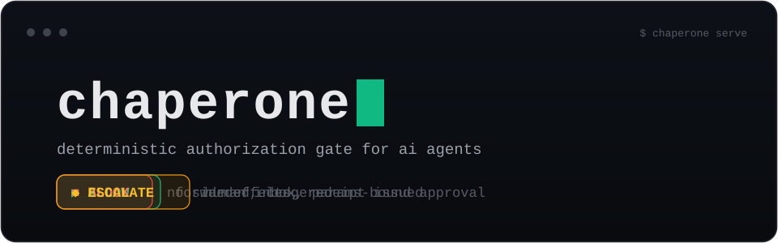

<div align="center">



**Seatbelts for `--dangerously-skip-permissions`.**

Chaperone is open-source **AI agent security infrastructure**. A deterministic
policy engine returns ALLOW / BLOCK / ESCALATE before every tool call, and a
tamper-evident audit ledger turns every decision into compliance evidence
(EU AI Act, SOC 2). Ships as a Claude Code / Cursor guardrail hook, an MCP
security gateway, and a stdio shim.

[](https://github.com/Jai-Keshav-Sharma/chaperone/actions/workflows/ci.yml)
[](LICENSE)
[](https://www.rust-lang.org)
[](CONTRIBUTING.md)

[Quickstart](#quickstart) · [Demo](#demo) · [Why not prompt-based guards?](#why-not-prompt-based-guards) · [Compliance](#compliance) · [Architecture](#architecture)

</div>

---

<video src="https://github.com/user-attachments/assets/7307875b-b388-4b0b-adad-13dfb551395e"
       controls muted playsinline width="100%"></video>

<p align="center"><sub>The full loop: agent asks to run <code>rm -rf /</code> → BLOCKED with a ledger receipt → risky refund ESCALATES → human approves → retry ALLOWED. One gate, every tool call.</sub></p>

## The 10-second version

Your agent runs 40 tool calls a minute. You are not watching. One prompt
injection, one hallucinated cleanup command, one "delete the test database"
and it is gone.

Chaperone stands between the agent and every tool. It is not a prompt, not a
wrapper around the model, not an honor system. It is a policy engine with one
job: every call gets a verdict, every verdict gets a receipt.

```
 agent ──▶ tool call ──▶ ┌───────────────┐
                         │  chaperone    │──▶ ALLOW    forward, ledgered
                         │  deterministic│──▶ BLOCK    deny, ledgered
                         │  < 6 ms p95   │──▶ ESCALATE human inbox, params-bound
                         └───────────────┘
                                │
                                ▼
                     append-only hash chain
                     RFC 6962 Merkle checkpoints
                     Ed25519-signed, exportable
```

No LLM in the decision path. A prompt injection cannot talk its way around a
rule, because there is nothing to talk to. That is the difference between
prompt-based guardrails and an enforcement layer: LLM guardrails that live in
the prompt are suggestions; Chaperone is infrastructure.

## Demo

<!-- Screenshots land here:
| | |
|---|---|
|  |  |
*Left: the human-in-the-loop inbox. Right: the live decision stream.*
*More screens in [`docs/assets/`](docs/assets/).*
-->

## Quickstart

```bash
git clone https://github.com/Jai-Keshav-Sharma/chaperone.git
cd chaperone
cargo build -p chaperone-cli --release

# install: DB + starter safety policy + hook wiring
chaperone init

# run the gate + dashboard API
chaperone serve
```

Open the dashboard, paste the token from `init`, ask your agent to
`rm -rf /`, and watch it get blocked with a receipt:

```bash
chaperone ledger verify      # CHAIN OK
```

Compile a policy from a plain-English SOP (PDF / Markdown / DOCX):

```bash
chaperone policy compile ./refund-sop.pdf --provider ollama
chaperone policy activate refund-sop
```

The compile is LLM-assisted, **offline**, and nothing activates without a
human pressing approve. The runtime never calls a model.

## Why not prompt-based guards?

| Approach | Failure mode |
|---|---|
| "Be careful" system prompts | Social engineering defeats it. Unverifiable. |
| Model self-reflection | The model is also the attack surface. |
| Ask-a-human-every-time | Unusable at 40 calls/minute. |
| **Chaperone** | **Deterministic rules, evaluated in ~6 ms, outside the model.** |

**One gate, three seams.** The same engine, inbox, and ledger guard every
surface an agent acts through:

- **`chaperone hook`** - PreToolUse interception for coding agents
  (Claude Code, Cursor). Every shell command, file write, and delete is
  checked before it runs.
- **`chaperone gateway`** - a streamable-HTTP reverse proxy in front of any
  MCP server. The org-wide chokepoint for customer-facing agents.
- **`chaperone shim`** - an MCP stdio proxy for desktop clients.

**Human oversight that binds.** Escalations are not a bare "approve" button.
An approval is bound to the exact parameter hash that was escalated, expires
on a timer, and is single-use. A sweeper auto-denies stale tickets.

**Proof, not logs.** Every verdict is written to an append-only SHA-256 hash
chain *before* the verdict is returned. Checkpoints are RFC 6962 Merkle trees
signed with Ed25519. Any tampering breaks the chain. Export evidence packs
with `chaperone ledger export --format eu-ai-act|soc2`.

## The numbers

Measured by the checked-in benchmark (`chaperone bench`, seed 1337, 1038
scenarios, 14 attack classes, real server over real HTTP). Wilson 95% CIs,
because point estimates are marketing:

| Metric | Result |
|---|---|
| Block recall on attack corpus | **1.000** (CI 0.992 - 1.000) |
| False-block rate on benign calls | **0.000** |
| p95 decision latency | **5.9 ms** |
| Ledger chain verified | **true** |
| Test suite | **149 tests, green** |

The gold policies and corpus are aligned by construction and checked in for
external audit. The CI lower bounds are the defensible claims.

## Compliance

Chaperone maps to the frameworks auditors already know. The honest claim: it
maps, it does not self-certify.

<details>
<summary><b>Framework mapping</b> (click to expand)</summary>

| Framework | Chaperone control |
|---|---|
| **OWASP Agentic Top 10 (ASI01-10)** | Out-of-band evaluation, param thresholds, identity decay, HITL with reasoning traces, kill switch |
| **EU AI Act** | Art. 9 per-action risk mgmt, Art. 12 tamper-evident logging, Art. 14 human oversight, Art. 72/73 monitoring + `--format eu-ai-act` export |
| **NIST AI RMF** | GOVERN (policy lifecycle), MAP (shadow mode), MEASURE (E1-E6 bench), MANAGE (the gate) |
| **CSA AARM v1.0** | R1-R6 mapped, launch claim "Aligned", Core conformance post-production |
| **SOC 2 / ISO 42001** | `chaperone ledger export --format soc2` evidence pack |
| **IETF WIMSE / MCP / EMA** | Consumes workload identity; per-call AuthZ lives in Chaperone, AuthN in the IdP |

Full tables: [`docs/compliance-mapping.md`](docs/compliance-mapping.md),
[`docs/aarm-mapping.md`](docs/aarm-mapping.md).

</details>

## Architecture

```
crates/
  chaperone-core/     pure library: models, IR, engine, ledger, storage,
                      cache, escalation, compiler
  chaperone-server/   axum app factory + frozen route set
  chaperone-cli/      the single `chaperone` binary
  chaperone-bench/    E1-E6 harness: attack corpus, gold policies, runner
dashboard/            React + TS: inbox, live stream, ledger explorer
```

The pure layers (models, IR, engine) do zero I/O. That is what makes replay,
differential testing against Cedar, and deterministic benchmarks possible.

The non-negotiables, enforced in code:

1. **Fail-closed always.** No fail-open flag exists. Any error blocks.
2. **No LLM in the decision path.** The model writes policy offline; a human
   approves it; the engine never calls one.
3. **Append-then-respond.** No ledger entry, no verdict.
4. **One canonical hashing path.** Everything hashed goes through one module.
5. **Determinism.** No wall clock, no randomness inside evaluation. Time is
   injected.

## Status

The core is implemented and tested end-to-end: deterministic evaluation,
hook interception with fail-closed denies, append-only ledger with signed
checkpoints, HITL escalations, the NL-to-policy compiler, dashboard, and the
benchmark. The MCP gateway and stdio shim seams land next (the signed
request-state HMAC core is done and tested). Roadmap:
[`docs/goals.md`](docs/goals.md).

## Contributing

Issues and PRs welcome. `make check` (fmt + clippy -D warnings) and
`make test` must pass. Windows is a first-class platform; CI runs
windows-latest and ubuntu-latest.

## License

Apache-2.0. See [LICENSE](LICENSE) and [NOTICE](NOTICE).
